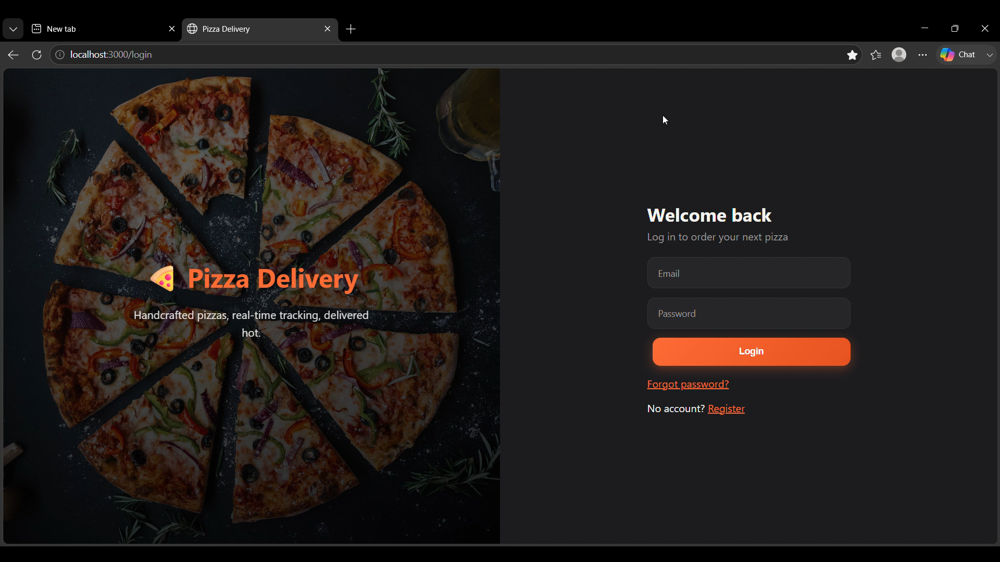
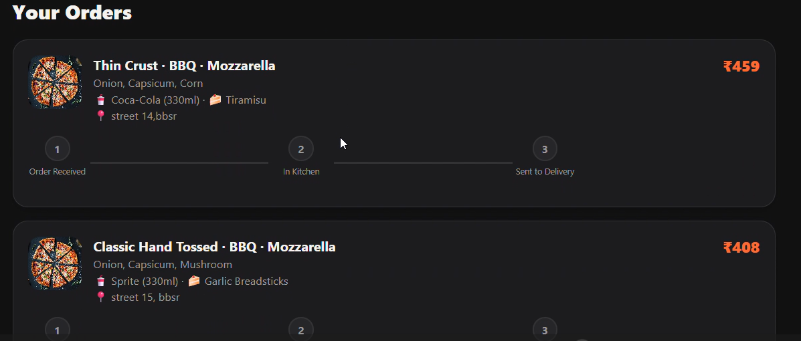
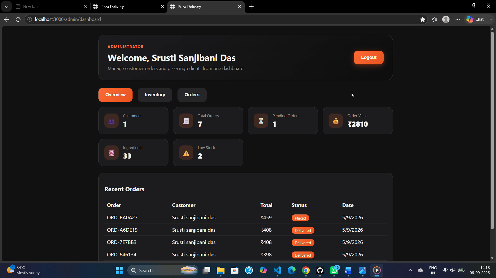
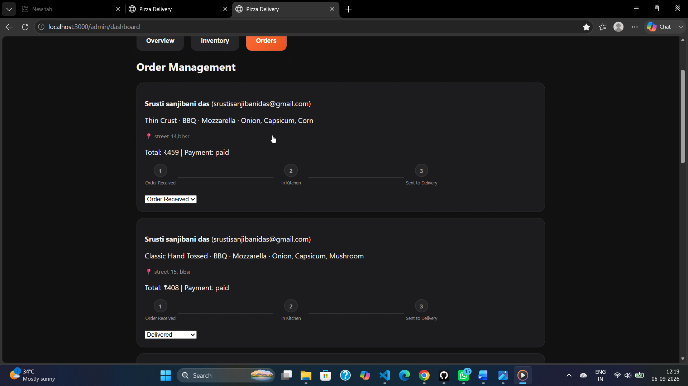

# 🍕 Pizza Delivery — Full-Stack Application

> **Oasis Infobyte Internship — Web Development Track, Level 3**
> A MERN-stack pizza ordering and inventory management platform with role-based access (User / Admin), Razorpay test-mode payments, live order status tracking, and automated low-stock email alerts.

---

## 📌 Overview

This application lets customers build a custom pizza from scratch, add drinks and desserts, pay securely via Razorpay, and track their order's progress in real time. On the admin side, staff can manage inventory, receive automated low-stock alerts, and update order statuses that instantly reflect on the customer's dashboard.

---

## ✨ Features

### User-facing
- 🔐 Secure registration with email verification
- 🔑 JWT-based login with forgot/reset password flow (emailed, time-limited links)
- 🍕 4-step guided pizza builder — base, sauce, cheese, vegetables (live inventory-driven options)
- 🥤 Add-on drinks and desserts
- 💳 Razorpay checkout integration (test mode)
- 📦 Order tracking with a 3-stage visual progress tracker: **Order Received → In Kitchen → Sent to Delivery**
- 🔄 Live status updates on the dashboard via polling (no manual refresh needed)

### Admin-facing
- 🔒 Separate, non-public admin login (accounts seeded via script — no open admin registration)
- 📊 Inventory dashboard with per-item stock and configurable low-stock threshold
- ✏️ Manual stock adjustment for any inventory item
- 📉 Automatic stock decrement on every completed order
- 📧 Automated low-stock email alerts — triggered instantly on stock change **and** via an hourly scheduled sweep (`node-cron`) as a safety net
- 🧾 Order management panel — view all incoming orders and update their status
- ⚡ Status changes propagate to the customer's dashboard automatically

---

## 🛠️ Tech Stack

| Layer | Technology |
|---|---|
| Frontend | React (Create React App), React Router |
| Backend | Node.js, Express.js |
| Database | MongoDB (Mongoose ODM) |
| Authentication | JSON Web Tokens (JWT), bcrypt password hashing |
| Payments | Razorpay (test mode) |
| Scheduled Jobs | node-cron |
| Email | Nodemailer (SMTP) |

---

## 📁 Project Structure

```
WebDev-L3-PizzaDelivery/
├── backend/                        Node.js + Express + MongoDB API
│   ├── config/db.js                 MongoDB connection
│   ├── models/                      User, Admin, Order, Inventory schemas
│   ├── controllers/                 authController, orderController, inventoryController
│   ├── routes/                      authRoutes, orderRoutes, inventoryRoutes
│   ├── middleware/auth.js           Role-aware JWT auth middleware
│   ├── jobs/stockCheckCron.js       Hourly low-stock sweep (node-cron)
│   ├── utils/                       sendEmail.js, seedAdmin.js, seedInventory.js
│   ├── server.js                    App entry point
│   └── .env.example
│
├── frontend/                       React application
│   ├── src/pages/user/               Register, Login, ForgotPassword, ResetPassword,
│   │                                 VerifyEmail, Dashboard, PizzaBuilder, OrderSummary
│   ├── src/pages/admin/              AdminLogin, AdminDashboard, InventoryManagement,
│   │                                 OrderManagement
│   ├── src/components/               ProtectedRoute, StatusTracker
│   ├── src/context/AuthContext.js
│   ├── src/api/axios.js
│   └── .env.example
│
├── screenshots/                    App screenshots for reference
├── README.md
└── LICENSE
```

---

## 🧩 Feature-to-Code Mapping

| Feature | Implementation |
|---|---|
| Registration + email verification | `authController.register` / `verifyEmail`, verification link sent via Nodemailer |
| JWT login | `authController.login`, enforced via `middleware/auth.js` |
| Forgot / reset password | `authController.forgotPassword` / `resetPassword`, 1-hour expiring emailed link |
| User dashboard | `pages/user/Dashboard.js`, polls `/api/orders/mine` every 8 seconds |
| Pizza builder | `pages/user/PizzaBuilder.js`, options fetched live from `/api/inventory/public` |
| Checkout via Razorpay | `pages/user/OrderSummary.js` + `orderController.createPaymentOrder` / `verifyAndPlaceOrder` |
| Order status tracking | `Order.status` enum (`Order Received`, `In Kitchen`, `Sent to Delivery`, `Delivered`, `Cancelled`) |
| Admin login (restricted) | `pages/admin/AdminLogin.js` + `/api/auth/admin/login`; accounts created only via `utils/seedAdmin.js` |
| Inventory management | `pages/admin/InventoryManagement.js` + `/api/inventory` |
| Auto stock decrement | `inventoryController.decrementStockForOrder`, invoked after payment verification |
| Manual stock update | `InventoryManagement.js` → `PUT /api/inventory/:id` |
| Low-stock email alerts | Instant check in `decrementStockForOrder` **+** hourly `node-cron` job (`jobs/stockCheckCron.js`); threshold is configurable per item |
| Order management panel | `pages/admin/OrderManagement.js` + `PUT /api/orders/:id/status` |
| Real-time-ish status sync | Polling every 8 seconds on the user dashboard |

> **Design note — polling vs. WebSockets:** this implementation uses polling rather than WebSockets/Socket.io, prioritizing simplicity and zero additional infrastructure. The REST API is already structured so that swapping the polling `useEffect` hooks for a `socket.io-client` listener (with `socket.io` added server-side) would be a drop-in upgrade path.

---

## ⚙️ Prerequisites

- Node.js 18+ and npm
- MongoDB (local instance at `mongodb://127.0.0.1:27017`, or a MongoDB Atlas connection string)
- A Razorpay account in **Test Mode** — [dashboard.razorpay.com](https://dashboard.razorpay.com/) → Settings → API Keys
- An SMTP-capable email account — a **Gmail App Password** is the easiest option (Google Account → Security → 2-Step Verification → App Passwords)

---

## 🚀 Getting Started

### 1. Backend Setup

```bash
cd backend
npm install
cp .env.example .env
```

Fill in `.env`:

```env
MONGO_URI=your_mongodb_connection_string
JWT_SECRET=any_long_random_string
SMTP_USER=your_email@gmail.com
SMTP_PASS=your_app_password
ADMIN_NOTIFY_EMAIL=admin_email_to_receive_alerts
RAZORPAY_KEY_ID=your_test_key_id
RAZORPAY_KEY_SECRET=your_test_key_secret
LOW_STOCK_THRESHOLD=20
```

Seed the database:

```bash
node utils/seedInventory.js
node utils/seedAdmin.js "Admin Name" admin@example.com StrongPass123
```

Start the server:

```bash
npm run dev     # with nodemon
# or
npm start
```

Backend runs at **http://localhost:5000**.

### 2. Frontend Setup

```bash
cd frontend
npm install
cp .env.example .env
```

Fill in `.env`:

```env
REACT_APP_API_URL=http://localhost:5000/api
REACT_APP_RAZORPAY_KEY=your_test_key_id
```

Start the app:

```bash
npm start
```

Frontend runs at **http://localhost:3000**.

---

## 🧪 Trying It Out

1. Register a new account at `/register`, then verify via the emailed link (or check the backend console if SMTP isn't configured yet).
2. Log in at `/login`, click **Build a Pizza**, and complete the 4-step builder.
3. Review your order at `/order-summary`, enter a delivery address, and click **Pay with Razorpay**.
4. Use Razorpay's test card (`4111 1111 1111 1111`, any future expiry, any CVV) — or the widget's built-in **Success** button in test mode.
5. Your order appears on the dashboard with status **Order Received**.
6. Log in at `/admin/login` with your seeded admin account, open the **Orders** tab, and progress the order through **In Kitchen → Sent to Delivery**. The change reflects on the user's dashboard within ~8 seconds.
7. In the **Inventory** tab, edit any item's stock below its threshold and save — a low-stock email fires immediately. The `node-cron` job additionally re-checks all inventory hourly.

---

## 📸 Screenshots

### User Dashboard


### Pizza Builder


### Order Summary & Razorpay Checkout


### Admin — Inventory Management


### Admin — Order Management

---

## 🌱 Future Improvements

- Replace polling with **Socket.io** for true real-time order updates
- Add **rate-limiting** (`express-rate-limit`) on authentication routes
- Add **refresh tokens** for smoother session handling
- Add **automated tests** (Jest / Supertest) for backend routes
- Deploy backend (Render / Railway / Fly.io) and frontend (Vercel / Netlify) for a live demo link

---

## 👩‍💻 Author

**Srusti Sanjibani Das**
Web Development Intern — Oasis Infobyte
Task: Level 3 — Pizza Delivery Full-Stack Application

---

## 📄 License

This project is licensed under the MIT License — see the [LICENSE](./LICENSE) file for details.
